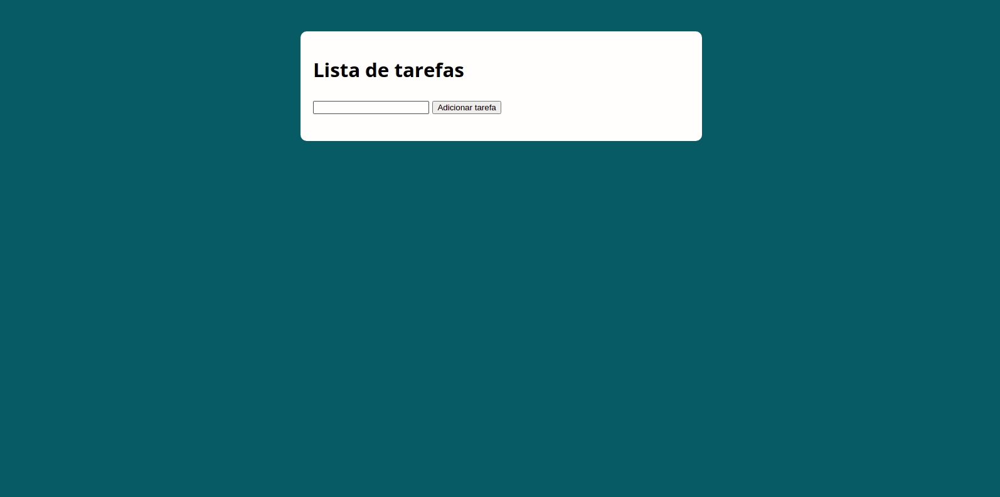

<h2 align="center">
 <b>Lista de tarefas</b> 
</h2>

    
  
  
  

  
  
  

  

## Objetivo

Aprimorar os conhecimento em Javascript, utilizando manipulação da DOM. 

Neste projeto utilizei HTML e CSS bem básico, pois o foco principal é no Javascript

### Clonar este repositório:

`git clone https://github.com/leandross86/TaskList_basic-with-Javascript.git`

## Como contribuir

- Fork esse repositório;
- Crie uma branch com a sua feature: `git checkout -b my-feature`
- Commit suas mudanças: `git commit -m 'feat: My new feature'`
- Push a sua branch: `git push origin my-feature`

Depois que o merge da sua pull request for feito, você pode deletar a sua branch.

## Licença

Esse projeto está sob a licença MIT. Veja o arquivo [LICENSE](LICENSE) para mais detalhes.

## 🤝 Créditos

[Luiz Otávio Miranda](https://www.youtube.com/user/todoespacoonline)